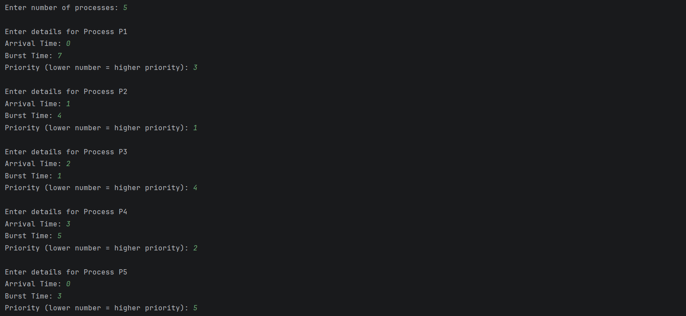
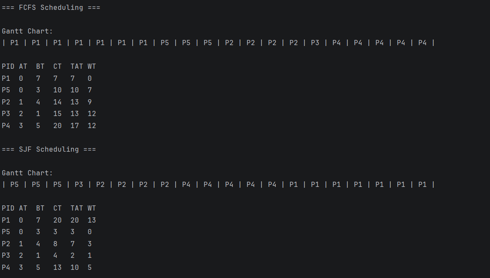
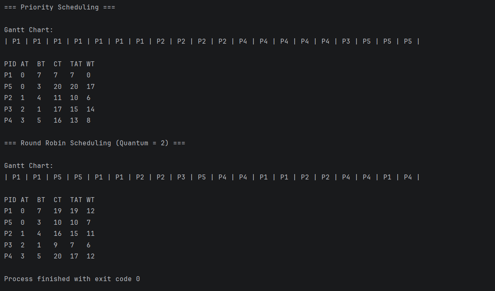

# CPU Scheduling Algorithms Simulation

This project implements and compares core **CPU scheduling algorithms** using a fixed set of processes.  
The goal is to demonstrate scheduling behavior, execution order, and performance metrics in a clear, reproducible way.

## Implemented Scheduling Algorithms

- **First Come First Serve (FCFS)** — *Non-Preemptive*
- **Shortest Job First (SJF)** — *Non-Preemptive*
- **Priority Scheduling** — *Non-Preemptive*
- **Round Robin (Time Quantum = 2)** — *Preemptive*

## Features
- Gantt Chart visualization (text-based)
- Calculation of:
  - Completion Time (CT)
  - Turnaround Time (TAT)
  - Waiting Time (WT)
- Consistent input across all algorithms for fair comparison

## Sample Output

## Use Case
- OS fundamentals practice
- Interview preparation
- Academic demonstrations of CPU scheduling concepts

## Notes
- Lower priority number indicates higher priority
- SJF and Priority scheduling are **non-preemptive**
- Round Robin uses a fixed time quantum

---
